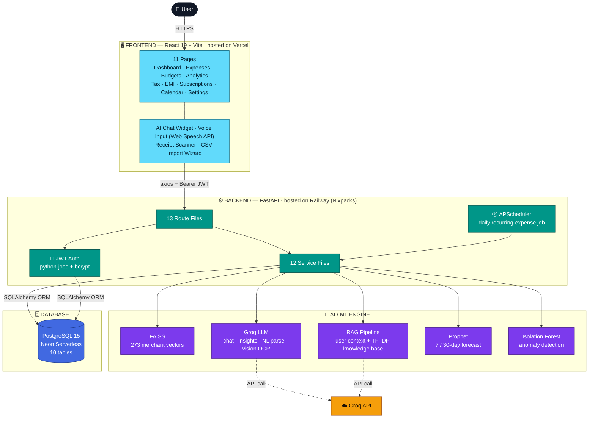

# FinPulse


**AI-powered personal finance management for Indian users.**

Track expenses, detect anomalies, forecast spending, plan taxes, and get personalized financial advice — all in one app built for how Indians actually manage money.

🔗 **Live App:** [fin-pulse-system.vercel.app](https://fin-pulse-system.vercel.app)

---

## What It Does

FinPulse is a full-stack personal finance web application that combines expense tracking with machine learning and AI to give users insights they can't get from a spreadsheet or a basic budgeting app.

**For everyday tracking:**
- Add expenses by typing, speaking, or scanning a receipt — the app auto-categorizes 273+ Indian merchants instantly using FAISS vector similarity
- Import bank statements (ICICI, HDFC, SBI CSV formats) with a two-step preview-then-confirm flow that catches duplicates before saving
- Track recurring subscriptions like Netflix, Spotify, and rent — the app detects patterns from your transaction history and auto-creates future expenses on schedule
- Set monthly budgets per category with AI-suggested amounts based on your actual spending history

**For financial intelligence:**
- ML anomaly detection (Isolation Forest) flags unusual spending — "₹12,000 on shopping is 3.8× your usual"
- 30-day spending forecasts with confidence intervals using Facebook Prophet
- A year-long spending heatmap showing daily spending intensity at a glance
- Financial health score (0–100) combining savings rate, budget adherence, and spending consistency

**For Indian financial planning:**
- Section 80C / 80CCD / 80D tax investment tracker with Old vs New regime comparison
- EMI and debt tracker with full reducing-balance amortization schedules
- AI chat assistant grounded in your real financial data AND a 60-chunk Indian personal finance knowledge base (PPF rates, ELSS lock-in periods, HRA rules, CIBIL score factors, and more)

**The AI isn't generic.** Every response from the FinPulse AI assistant references your actual numbers — your real income, your real spending by category, your real budget status — not textbook advice.

---

## Architecture Overview



---

## Tech Stack

### Frontend
| Technology | Purpose |
|---|---|
| React 19 + Vite 8 | SPA framework and build tool |
| Tailwind CSS 3 | Utility-first styling with custom design tokens |
| Framer Motion | Page transitions, micro-interactions, animated dashboard |
| Recharts | Charts — bar, line, area, pie, composed |
| Lucide React | Icon library |
| React Router v7 | Client-side routing with auth guards |
| Axios | HTTP client with JWT interceptor |
| Web Speech API | Browser-native voice expense entry (en-IN) |

### Backend
| Technology | Purpose |
|---|---|
| FastAPI + Uvicorn | Async Python web framework |
| SQLAlchemy 2.x | ORM with PostgreSQL and SQLite support |
| Pydantic v2 | Request/response validation |
| python-jose + bcrypt | JWT authentication (HS256, 120 min expiry) |
| APScheduler | Background job scheduling for recurring expenses |

### AI / ML
| Technology | Purpose |
|---|---|
| FAISS (faiss-cpu) | Vector similarity search for merchant categorization |
| Groq SDK | LLM inference — chat, insights, NL parsing, receipt OCR |
| Facebook Prophet | Time-series spending forecasts with confidence intervals |
| scikit-learn | Isolation Forest anomaly detection + TF-IDF for RAG retrieval |
| Pre-computed embeddings | all-MiniLM-L6-v2 vectors for 273 merchants (no torch at runtime) |

### Database
| Technology | Purpose |
|---|---|
| PostgreSQL 15 (Neon) | Production serverless database |
| SQLite | Local development and CI testing |

### Infrastructure
| Technology | Purpose |
|---|---|
| Vercel | Frontend hosting with auto-deploy from GitHub |
| Railway | Backend hosting with Nixpacks buildpack |
| GitHub Actions | CI pipeline — 30 pytest tests on every push |
| Docker + docker-compose | One-command local development setup |

---

## Features

### Expense Management
- **Smart Add** — type a natural language expense ("₹450 Swiggy dinner") and AI parses it into structured data
- **Voice Entry** — tap the mic button and speak your expense in English (Indian accent supported)
- **Receipt Scanner** — upload a photo of a receipt, Groq vision model extracts the details
- **Auto-Categorization** — FAISS matches against 273+ Indian merchants (Swiggy, Zomato, DMart, Ola, Netflix, etc.) with Groq LLM fallback for unknown merchants
- **15 India-specific categories** — Rent, Groceries, Food, Utilities, Transport, Shopping, Entertainment, Health, Education, Bills, Investment, EMI, Personal, Travel, Other

### Bank Statement Import
- Upload CSV exports from ICICI, HDFC, SBI, or any bank
- Intelligent parsing handles bank-specific headers and preamble rows
- Two-step safety flow: preview everything first (nothing saved), then confirm
- Duplicate detection flags same-amount transactions within 2 days
- Transaction description cleaning strips UPI/POS/NEFT reference numbers automatically

### Budgets & Goals
- Set monthly budgets per category, tracked against actual spending
- **AI Suggested Budgets** — analyzes your last 4 months and suggests realistic limits
- **Budget Rules** — rollover unused budget to next month, auto-save to goals on income
- Savings goals with progress tracking and deadline management
- Negative saved_amount validation prevents data corruption

### Subscriptions & Recurring
- Client-side recurring pattern detection from expense history
- Confirm detected patterns to enable auto-tracking
- Auto-creates expenses on schedule with duplicate-checking against existing data (prevents double-counting after CSV imports)
- Pause and cancel controls with resume capability
- "Upcoming This Week" Dashboard widget

### Analytics & Insights
- **Financial Health Score** (0–100) with clickable breakdown on Dashboard
- **Spending Heatmap** — GitHub-style 52-week calendar grid colored by daily spending intensity
- **Category Breakdown** — ranked bar chart of spending by category
- **Spending Forecast** — Prophet ML model predicts next 7 and 30 days with 80% confidence bands
- **Anomaly Detection** — Isolation Forest flags statistical spending outliers
- **Progressive Disclosure** — new users see simpler analytics that grow more detailed as data accumulates

### AI Chat Assistant
- **RAG-powered** — every response includes your real financial data (income, expenses, savings rate, budget status, goal progress, recent anomalies)
- **Indian finance knowledge base** — 60 curated chunks covering Section 80C, ELSS vs PPF, SIP basics, credit scores, insurance, emergency funds, tax regimes, and more
- **Session memory** — the AI remembers the last 5 messages in a conversation, enabling follow-up questions like "What about last month?" after asking about food spending
- **TF-IDF retrieval** — only relevant knowledge chunks are injected into each response, keeping answers focused

### EMI & Debt Tracker
- Track home loans, car loans, personal loans, education loans, consumer EMIs
- Full reducing-balance amortization schedule with month-by-month breakdown
- Prepayment support with recalculated tenure
- Zero-interest EMI support for consumer purchases
- Dashboard integration — Safe to Spend accounts for total monthly EMI burden

### Tax Planner
- Track Section 80C investments (PPF, ELSS, NSC, LIC, EPF, FD, home loan principal, tuition fees) against ₹1,50,000 limit
- Section 80CCD(1B) NPS tracker (₹50,000 additional limit)
- Section 80D health insurance tracker (₹25,000 self + ₹50,000 parents)
- **Old vs New tax regime comparison** with per-slab calculation, Section 87A rebate, 4% cess, and a plain-English recommendation
- Progress bars per section showing utilization percentage

### Dashboard
- Monthly KPI cards (Income, Expenses, Savings) with visible month labels
- Health Score with tap-to-explain breakdown
- Safe to Spend per day with transparent formula (shows when 30% fallback is used)
- Weekly Financial Report with day-of-week bar chart
- Smart Alerts, Anomaly Alerts, EMI Overview, Upcoming Subscriptions
- What-If Simulator (adjust income/expenses, see impact on savings)
- Spending projection with minimum-data threshold (no misleading early-month extrapolations)

### Other
- **Onboarding Wizard** — 3-step guided setup for new users (income → expenses → budgets)
- **Recurring Income** — set "₹72,000 monthly salary" once, auto-fills every future month
- **Financial Inbox** — unified alert timeline with dismiss persistence and auto-dismiss on action
- **Cashflow Calendar** — month grid with colored event dots and projected balance chart
- **Light/Dark mode** with full design system compliance across all components
- **Landing Page** with animated mini-dashboard demo, feature showcase, and inline auth modal

---

## Getting Started

### Prerequisites
- Node.js 18+
- Python 3.11+
- A Groq API key (free at [console.groq.com](https://console.groq.com))

### Local Development (with Docker)

The fastest way to run everything:

```bash
git clone https://github.com/Vedika1006/FinPulse-system.git
cd FinPulse-system
export GROQ_API_KEY=your-groq-key-here
docker-compose up --build
```

Open [http://localhost:3000](http://localhost:3000). This starts the frontend, backend, and a PostgreSQL database together.

### Local Development (without Docker)

**Backend:**
```bash
cd backend
python -m venv venv
source venv/bin/activate        # Windows: venv\Scripts\activate
pip install -r requirements.txt
```

Create `backend/.env`:
```
DATABASE_URL=sqlite:///./finpulse.db
GROQ_API_KEY=your-groq-key-here
SECRET_KEY=any-random-string-for-jwt
ALGORITHM=HS256
```

```bash
uvicorn app.main:app --reload --port 8000
```

**Frontend:**
```bash
cd frontend
npm install
```

Create `frontend/.env`:
```
VITE_API_URL=http://localhost:8000
```

```bash
npm run dev
```

Open [http://localhost:5173](http://localhost:5173).

---

## Running Tests

```bash
cd backend
pip install pytest httpx
pytest tests/ -v
```

30 tests covering authentication, expense CRUD, budget logic, EMI amortization math, tax slab calculations, CSV parsing, recurring expense processing, goal validation, and AI endpoint contracts.

Tests use SQLite in-memory (never touches production data) with Groq calls mocked.

---

## Environment Variables

### Backend
| Variable | Required | Description |
|---|---|---|
| `DATABASE_URL` | Yes | PostgreSQL connection string (or omit for SQLite) |
| `GROQ_API_KEY` | Yes | Groq API key for LLM features |
| `SECRET_KEY` | Yes | JWT signing secret |
| `ALGORITHM` | No | JWT algorithm (default: HS256) |
| `GROQ_CHAT_MODEL` | No | Override chat model (default: llama-3.3-70b-versatile) |
| `GROQ_FAST_MODEL` | No | Override fast model (default: llama-3.1-8b-instant) |
| `GROQ_VISION_MODEL` | No | Override vision model (default: llama-4-scout-17b-16e-instruct) |

### Frontend
| Variable | Required | Description |
|---|---|---|
| `VITE_API_URL` | Yes | Backend API URL |

---

## Project Structure

```
FinPulse-system/
├── .github/
│   └── workflows/
│       └── test.yml                    # CI pipeline — 30 pytest tests on every push
│
├── backend/
│   ├── app/
│   │   ├── core/
│   │   │   ├── exception_handler.py
│   │   │   ├── exceptions.py
│   │   │   └── security.py             # JWT decode + get_current_user dependency
│   │   ├── data/
│   │   │   ├── merchant_labels.json    # FAISS artifact — category per merchant
│   │   │   ├── merchant_names.json     # FAISS artifact — merchant name list
│   │   │   └── merchant_vectors.npy    # FAISS artifact — precomputed embeddings
│   │   ├── routes/
│   │   │   ├── ai.py
│   │   │   ├── analytics.py
│   │   │   ├── auth.py
│   │   │   ├── auto_save_rules.py
│   │   │   ├── budgets.py
│   │   │   ├── emi.py
│   │   │   ├── expenses.py
│   │   │   ├── goals.py
│   │   │   ├── imports.py
│   │   │   ├── income.py
│   │   │   ├── receipts.py
│   │   │   ├── recurring.py
│   │   │   └── tax.py
│   │   ├── services/
│   │   │   ├── ai_service.py
│   │   │   ├── analytics_service.py
│   │   │   ├── categorization_service.py
│   │   │   ├── csv_import_service.py
│   │   │   ├── emi_service.py
│   │   │   ├── income_service.py
│   │   │   ├── memory_service.py
│   │   │   ├── ocr_service.py
│   │   │   ├── rag_context_service.py
│   │   │   ├── rag_knowledge_base.py
│   │   │   ├── recurring_service.py
│   │   │   └── tax_service.py
│   │   ├── database.py                 # DB engine + session management
│   │   ├── main.py                     # App startup, middleware, scheduler
│   │   ├── models.py                   # SQLAlchemy models (10 tables)
│   │   ├── schemas.py                  # Pydantic request/response models
│   │   └── utils.py
│   ├── scripts/
│   │   └── build_embeddings.py         # Offline FAISS embedding builder
│   ├── tests/
│   │   ├── conftest.py                 # SQLite in-memory fixtures
│   │   ├── test_ai.py
│   │   ├── test_analytics.py
│   │   ├── test_auth.py
│   │   ├── test_budgets.py
│   │   ├── test_csv_import.py
│   │   ├── test_emi.py
│   │   ├── test_expenses.py
│   │   ├── test_goals.py
│   │   ├── test_income.py
│   │   ├── test_recurring.py
│   │   └── test_tax.py
│   ├── Dockerfile
│   ├── nixpacks.toml                   # Railway build config
│   ├── Procfile
│   ├── railway.toml
│   ├── requirements.txt                # Full deps (incl. Prophet/cmdstanpy)
│   ├── requirements-test.txt           # Slim deps for fast CI installs
│   └── start.sh                        # uvicorn launch command
│
├── frontend/
│   ├── public/
│   │   ├── favicon.png
│   │   ├── icons.svg
│   │   └── logo.png
│   ├── src/
│   │   ├── api/                        # Axios wrappers per resource
│   │   │   ├── analytics.js
│   │   │   ├── auth.js
│   │   │   ├── autoSaveRules.js
│   │   │   ├── axios.js                # Axios instance + JWT interceptor
│   │   │   ├── budgets.js
│   │   │   ├── dashboard.js
│   │   │   ├── expenses.js
│   │   │   ├── goals.js
│   │   │   ├── imports.js
│   │   │   └── income.js
│   │   ├── components/
│   │   │   ├── dashboard/               # Dashboard-only subcomponents
│   │   │   │   ├── EMIOverview.jsx
│   │   │   │   ├── HeroBanner.jsx
│   │   │   │   ├── KPICards.jsx
│   │   │   │   ├── MonthlyTrend.jsx
│   │   │   │   ├── SmartAlerts.jsx
│   │   │   │   ├── UpcomingSubscriptions.jsx
│   │   │   │   └── WeeklyReport.jsx
│   │   │   ├── landing/                 # Landing-page-only visuals
│   │   │   │   ├── DashboardMockup.jsx
│   │   │   │   ├── FeatureRow.jsx
│   │   │   │   ├── FeatureVisuals.jsx
│   │   │   │   ├── HowItWorks.jsx
│   │   │   │   ├── ProblemSection.jsx
│   │   │   │   ├── TechCredibility.jsx
│   │   │   │   └── motionVariants.js
│   │   │   ├── ui/                      # Shared primitives
│   │   │   │   ├── AlertBanner.jsx
│   │   │   │   ├── Card.jsx
│   │   │   │   ├── ConfirmDialog.jsx
│   │   │   │   ├── EmptyState.jsx
│   │   │   │   ├── Modal.jsx
│   │   │   │   ├── ProgressBar.jsx
│   │   │   │   ├── Skeleton.jsx
│   │   │   │   └── Spinner.jsx
│   │   │   ├── AIChat.jsx               # Floating AI chat widget (all pages)
│   │   │   ├── AIFinancialInsights.jsx
│   │   │   ├── AnomalyAlerts.jsx
│   │   │   ├── AuthModal.jsx
│   │   │   ├── BehaviorCard.jsx
│   │   │   ├── CategorySuggester.jsx
│   │   │   ├── ErrorBoundary.jsx
│   │   │   ├── ForecastChart.jsx
│   │   │   ├── FormattedAIResponse.jsx
│   │   │   ├── InsightCard.jsx
│   │   │   ├── Layout.jsx               # Sidebar + Navbar + AIChat wrapper
│   │   │   ├── Navbar.jsx
│   │   │   ├── NLExpenseInput.jsx       # Text + voice expense entry
│   │   │   ├── NotificationBell.jsx
│   │   │   ├── OnboardingWizard.jsx
│   │   │   ├── ReceiptScanner.jsx
│   │   │   ├── Sidebar.jsx
│   │   │   ├── SpendingForecast.jsx
│   │   │   ├── SpendingHeatmap.jsx
│   │   │   ├── ToastProvider.jsx
│   │   │   └── WhatIfSimulator.jsx
│   │   ├── constants/
│   │   │   └── categories.js
│   │   ├── context/
│   │   │   └── ThemeContext.jsx         # Light/dark + currency state
│   │   ├── hooks/
│   │   │   ├── useCountUp.js
│   │   │   └── useTypewriter.js
│   │   ├── pages/                       # 13 route components
│   │   │   ├── Analytics.jsx
│   │   │   ├── Budgets.jsx
│   │   │   ├── CashflowCalendar.jsx
│   │   │   ├── Dashboard.jsx
│   │   │   ├── EMI.jsx
│   │   │   ├── Expenses.jsx
│   │   │   ├── FinancialInbox.jsx
│   │   │   ├── LandingPage.jsx
│   │   │   ├── Login.jsx
│   │   │   ├── MoneyImport.jsx
│   │   │   ├── Settings.jsx
│   │   │   ├── Subscriptions.jsx
│   │   │   └── Tax.jsx
│   │   ├── utils/
│   │   │   ├── auth.js
│   │   │   ├── buildAlerts.js
│   │   │   ├── currency.js
│   │   │   ├── dueDate.js
│   │   │   ├── inferInsightVariant.js
│   │   │   ├── mapInsightToActions.js
│   │   │   └── month.js
│   │   ├── App.jsx                      # Route definitions + auth guards
│   │   ├── index.css
│   │   └── main.jsx
│   ├── Dockerfile
│   ├── eslint.config.js
│   ├── index.html
│   ├── package.json
│   ├── postcss.config.js
│   ├── tailwind.config.js
│   └── vercel.json                      # SPA rewrite rule
│
├── docker-compose.yml                   # One-command local setup
├── LICENSE
└── README.md
```

---

## Database Schema

```
users ──┬──< expenses
        ├──< income
        ├──< budgets
        ├──< goals ──< auto_save_rules
        ├──< recurring
        ├──< debts
        ├──< tax_investments
        └──── user_memory (1:1)
```

10 tables, all with user_id foreign keys. No Alembic — schema migrations are handled by a runtime `_ensure_schema()` function that idempotently adds columns to existing tables.

---

## Deployment

| Component | Platform | Trigger |
|---|---|---|
| Frontend | Vercel | Auto-deploy on push to `main` |
| Backend | Railway (Nixpacks) | Auto-deploy on push to `main` |
| Database | Neon | Serverless PostgreSQL, always-on |
| CI | GitHub Actions | Runs 30 tests on every push |

---

## Acknowledgments

Built as a campus placement project demonstrating full-stack development, machine learning integration, and product design thinking.

---

## License

This project is licensed under the [MIT License](LICENSE).
